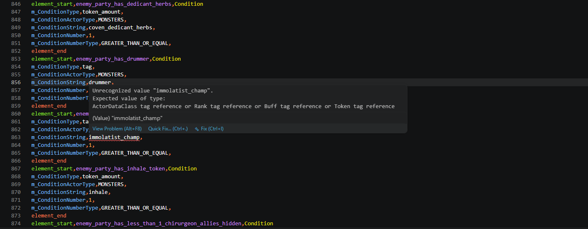
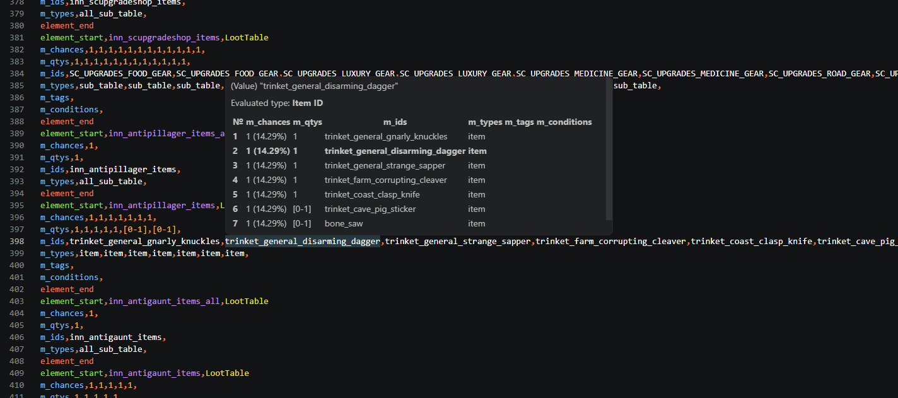

# CSV Extension for Darkest Dungeon 2

Syntax highlighting and validation for Darkest Dungeon 2 CSV files.

<!-- TOC tocDepth:2..3 chapterDepth:2..6 -->

- [Extension Features](#extension-features)
- [DD2 CSV Data Overview](#dd2-csv-data-overview)
- [CSV Data Description](#csv-data-description)
- [Extension Documentation](#extension-documentation)
    - [Data description](#data-description)
    - [Main process](#main-process)
    - [File scopes](#file-scopes)

<!-- /TOC -->

## Extension Features

This extension has these features (can be toggled off in settings):
- Syntax highlighting for DD2 CSV files.
- Validation of elements, fields, and values.
- Hints on hover for fields and values.
- Jump to Definition (acessible through hover).


*Missing tag definition*


*Table view for TableElements*

## DD2 CSV Data Overview

Darkest Dungeon 2's CSV data is stored in .csv files but the data format differs from common CSV data. All commas are separators. CSV filenames should end with `.Group.csv` otherwise the game will not read them.

Unless mod data is supposed override original data, mod's CSV files should be placed on the top level of the mod folder. Dividing data into separate files or putting everything in one file is an arbitrary choice. All files are parsed independently a into one data pool each time a game save file is loaded.

A DD2 CSV file's data consists of blocks called elements. Each element has an ID (not necessarily unique), and a type. A typical element looks like this:
```csv
element_start,hwm_point_blank_shot,ActorDataEffects
target_effects,move_knockback_1,prime_combo,
performer_effects,move_backward_1,
element_end
```
`hwm_point_blank_shot` is its ID, `ActorDataEffects` is its type. `element_start` and `element_end` mark element's boundary. An element can provide some data to the game. The kind of data that can be provided depends on element's type. Element's data consists of fields with values. One field with its values takes one line (with one exception). Field's name is the part of the line before the first comma. Field's values follow after.

`ActorDataEffects` is one of the types of elements that provide gameplay effects for entities. This example element tells the game that some entity can knockback, apply combo, and move the performer backward. The `target_effects` field tells what effects will be applied to target. This field accepts other element IDs as values. `move_knockback_1`, `prime_combo`, and `move_backward_1` are IDs of other elements:

```csv
element_start,move_knockback_1,Effect
m_Chance,1,
m_Move,1,
element_end

element_start,prime_combo,Effect
m_Chance,1,
m_TokenAddId,combo,
m_TokenAddAmount,1,
m_ShowValue,False,
element_end

element_start,move_backward_1,Effect
m_Chance,1,
m_IgnoreResist,True,
m_Move,1,
element_end
```

To tell what entity will have these effects, `hwm_point_blank_shot` needs to be connected to that entity. If `Effect` elements are connected to the `hwm_point_blank_shot` element through the `target_effects`, the `hwm_point_blank_shot` element is connected to a `ActorDataSkill` element via a shared ID:

```csv
lement_start,hwm_point_blank_shot,ActorDataSkill
m_IsFriendly,False,
launch_ranks,1,
target_ranks,1,
...
element_end

element_start,hwm_point_blank_shot,ActorDataStats
key_map,health_damage,health_damage_range,crit_chance,
add_stats,6,4,0.1,
element_end

element_start,hwm_point_blank_shot,ActorDataEffects
...
element_end
```

So the example `ActorDataEffects` element defines what effects the Point Blank Shot skill has. This skill also needs to be connected, but the connection between actors and skills (except path skills) is defined outside CSV data, in compiled game files.

The game's folder with official data has this structure:
```
Excel
├───dlc_catacombs
├───dlc_dul_cru
├───dlc_origin_skins
├───dlc_supporter
├───expedition
└───kingdom
```

Mod folders look like this:

```
Mod folder
├───Assets
├───dlc_catacombs
├───dlc_dul_cru
├───dlc_origin_skins
├───dlc_supporter
├───expedition
├───kingdom
├───Localization
└───Overrides
    ├───dlc_catacombs
    ├───dlc_dul_cru
    ├───dlc_origin_skins
    └───dlc_supporter
```

When a save file is being loaded the game loads CSV files in this order (probably):
1. Base game CSV files from the top level of the Excel folder.
2. DLC files (IB, TBB, HOP, ISP).
3. Then the game checks if this is a Kingdoms or an Expedition save. If this is an Expedition save, files from the `expedition` folder are loaded, and the `kingdom` folder is ignored. If this is a Kingdoms save, its the other way around. Data from these two folders can override previously gathered data. 
4. Then mods are loaded. For each mod folder:
	1. Data from the top folder of the mod is gathered, this data does not override previously gathered data.
	2. Data from DLC-related folders. This data does not override previously gathered data.
	3. Depending on the game type, files either from `expedition` or `kingdom` folder are gathered. Data from this folder does not override previously gathered data.
	4. The `Overrides` folder is checked:
		1. Files on the top level of this folder are gathered, they override previously gathered data.
		2. Game type folder is gathered. Overrides previously gathered data.
		3. Data from DLC-related folders, overrides previously gathered data.

More details:
- Element IDs are not unique, and neither unique are pairs of IDs with types. For example, `LootTables` elements are additive, there can be multiple `LootTable` elements with the same ID. Not all elements have this behavior, but loot table elements are not the only ones.
- Fields in elements can repeat. For example, `sub_stat` field can be repeated multiple times to add multiple substats.
- Some fields are position-sensitive. For example, `add_stats` and `multiply_stats` fields can be written right after a `key_map` field only.
- Some fields accept data of various nature. For example, `m_RankTags` field accepts an integer, then a tag string, then repeats.
- `KingdomMap` is an odd element type that has no named fields.
- Some fields accept different types of values depending on other fields, for example, `m_ConditionString` can accept a tag or an `Item` ID depending on the value of the `m_ConditionType` field in the same element.
- Some fields specify data outside CSV files, like localization indexes, directories, audio-related information.
- In some places values can be combined using `+` symbol. It looks like this is allowed only in these situations:
	- Table entries (`LootTable`, `BattleConfigurationTable`, `InnTable`): conditions can be combined using `+` symbol. For example, `is_confessions+has_0_stagecoach_wheels`. Outside table condition entries the `+` symbol is treated as a regular character, for example, in the `quirk_dare_devil_dmg_+10pct` buff.
	- `m_ConditionString` fields can use `+` too. For example, `m_ConditionString,resistance+bleed`. The first value needs to be an actor stat, the second needs to be a substat.
- Some CSV parts are case-sensitive. IDs, tags, and field names are case-sensitive. Keywords like `resistance` in `sub_stat,resistance,stun,0.1,` or `TOKEN_ADD` in `m_IgnoredSkillAttributeTypes` are not case-sensitive.
- `m_ConditionString` field uses `null` keyword as input. `m_DeathChainLootIds` field uses `none` keyword as input.
- Some fields that depend on other fields can have empty strings as valid values. For example:
	```csv
	element_start,swine_mashes_resist_kingdoms,BattleConfigurationTable
	m_chances,1,3,
	m_ids,swine_mashes_normal_kingdoms,swine_mashes_hard_kingdoms,
	m_types,sub_table,sub_table,
	m_tags,
	m_conditions,,escalation_is_over_1,
	element_end
	```
	Here `m_conditions` sets a condition for the `swine_mashes_hard_kingdoms` subtable to be a valid result. `m_chances` has to have values for each entry.
- Arbitrary values can be defined in some places, and in some places they are referenced.
	- IDs are defined in next to `element_start`. It seems that fields do not define IDs.
	- Tags are defined in fields.
	- Substats. They might be arbitrary. I don't know how these work.

This extension tries to describe all this data in a formal way. Outer structure of elements (`element_begin`, `ID`, `type`, `element_end`) is considered fixed, structure of field inputs is described in this way:
- `any` -- external information like localization, directories. Also used for fields of unknown nature. These fields are not validated.
- `float` -- single decimal value, for example `m_Chance,0.05`.
- `int` -- single integer value, for example `m_Size,1`.
- `bool` -- single boolean value, either `True` or `False`.
- `range` -- a range of integer values, for example `m_qtys,[1-2]`.
- `X ID` -- ID of existing element of type `X`.
- `X KW` -- a hardcoded value from a list of values `X`, for example `m_DurationType,round_end`.
- `X Tag+` -- an arbitrary tag of group `X`, for example `m_Tags,debuff` in `Buff` definitions.
- `X Tag-` -- an existing tag, for example `m_BuffRemoveAllTags,debuff` in `Effect` definitions.
- `List(T)` -- a list of values of the same type `T`, for example `List(Effect ID)` is satisfied by `target_effects,add_1_torso_target,end_combo,`. Lists can have empty values like `m_conditions,,is_kingdoms,,`.
- `Seq(T1,T2,T3,...)` -- a sequence of values of certain types. First value has to have `T1` type, second value has to have `T2` type, and so on. For example, `Seq(Cost ID,float,float)` is satisfied by `cost,char_cosmetics_price_1,0,0.167`.
- `Or(T1,T2,T3,...)` -- a single value of one of the specified types. For example, `List(Or(int,range))` is satisfied by `m_qtys,1,[12-24],20`.
- `Dep(X)` -- a field that uses different types of values depending on the `X` field from the same element. For example, `m_ConditionString` can accept a `Token` tag, `ActorDataClass` ID, `Unlock ID` etc. depending on the value of the `m_ConditionType` field.
	- If `X` field uses a list of values, then the dependent field needs to compare its values to `X`'s values in order. For example, `m_types,item,sub_table,` in a `LootTable` element binds `m_ids` field to have an `Item` ID first, and then a `LootTable` ID second, like `m_ids,quest_beastmen_ambulance_designation,HERO_POINT`.
- `Dep*(X)` -- the same as `Dep(X)` but requires all values to be provided. For example, in `LootTable` elements, `m_conditions` field can have empty values, like `m_conditions,,is_kingdoms,,,,`. But `m_chances` in the same element needs to provide a number for each entry.
- `nothing` is used for unused fields, like `m_profileLevel` field.
- `Sub(X KW,A,float)` is used for substats. The first value is a stat group. The second value is the substat.
- `PSV(X)` -- values separated by `+`.

## CSV Data Description

_DD2CSVMMDDescription

## Extension Documentation

### Data description

Description of CSV data is stored in `./CSV Description` directory in LibreOffice Calc files.
- `CSV Elements.ods` stores the list of element types and some comments.
- `CSV Fields.ods` has multiple sheets, each sheet corresponds to one element type. A sheet in this file contains field names, their input description in the format described above, and a comment.
- `CSV Values.ods` stores keywords and dependency information. It has multiple sheets, one sheet corresponds to one keyword group. The first column contains all possible values, other columns store information about how a specific keyword affects other fields.
	- For example, `CSV Fields.ods` describes *m_ConditionType*'s input in a *Condition* element as *ConditionType KW*. The extension takes the word before "KW" (that is *ConditionType*) and searches the sheet with the same name in `CSV Values.ods`. If this sheet does not have the provided value, the extension marks this value as an error.
	- Then, `CSV Fields.ods` describes *m_ConditionString* as `Dep(m_ConditionType)` which means that its input depends on the value of the *m_ConditionType* field in the same element. The extension searches `CSV Values.ods` for the "m_ConditionType" sheet and then searches for the column named [element type + field name], in this example it's "Condition m_ConditionString". This column describes what input should this field have depending on the value of another column.
	- Similar case are substat fields. For example, *ActorDataStats*' *sub_stat* field. It's input is described as `Sub(ActorStatSubType KW,Substat,float)`. The extension searches the "ActorStatSubType" sheet in `CSV Values.ods` and then searches for the "Substat" column that has the required input description.

### Main process

On startup:
1. The extension reads contents of the VSCode project and Excel directories from the Darkest Dungeon II installation folder.
   Excel directories can be configured in extension's settings.
2. Each file is parsed into a list of elements, fields, values by commas. The `+` separator is not processed yet.
   After this step the extension has a list of files and what elements are stored in each file.
   Exact positions of fields and values in text are also stored.
3. Then each element is analyzed for IDs and tags.
   A separate storage is created for tag/id symbols and their references and what elements they belong to.
   It allows to track connections between elements.
4. With IDs and tags indexed, validation of elements becomes possible.
   During this step diagnostics are created and value types are clarified (`Dep`, `List` and other types are converted to more primitive types).
   Certain types cannot be reduced to primitive values, for example:
	- Unions: `m_TokenGlossaryHeroTag` field, despite its name, accepts hero tags or hero IDs. If provided value matches to both tag and ID, union cannot be reduced.
	- Plus-separated values: one value string contains multiple values.
   These values are stored along with primitive values. Hover hint and semantic token managers resolve them on their own.

On text change:
1. Old and new texts are compared, all elements in the changed region are reparsed and the old element data is replaced.
2. Before replacing old elements, the extension tracks what ID and tag definitions they have, and what other elements depend on these definitions so they can be revalidated.
3. New elements are indexed, and their connections to existing elements are tracked so affected elements can be revalidated.

### File scopes

This extension tries to process Overrides by defining file scopes. There are no scopes defined by the game, each overrides just happen in the order in which they are met. Later overrides replace previously gathered data. But the extension needs to keep track of all elements in all game modes. So each file has one of these scopes assigned:
- General: e.g. files in the top folder of the mod.
- Expedition: `expedition` folder.
- Kingdom: `kingdom` folder.
- GeneralOverride: top level of the `Overrides` folder.
- ExpeditionOverride: `Overrides/expedition` folder.
- KingdomOverride: `Overrides/kingdom` folder.

Each scope has applicable Game Modes:
- General/GeneralOverride: both Expeditions and Kingdoms Game Modes.
- Expedition/ExpeditionOverride: only Expeditions Game Mode.
- Kingdom/KingdomOverride: only Kingdoms Game Mode.

When the extension finds multiple elements with the same type, ID, and Game Mode, and they are not addable, it looks at the scopes of their respective files where they are defined.

If all these elements have the same file scope, the extension shows a warning about them not being addable.

If these elements have different scopes, then the extension filters out overridden elements:
- If elements are applicable for Expedition: General scope is overridden by Expedition scope which is overridden by a pair of (GeneralOverride and ExpeditionOverride).
- Similar process if elements are applicable for Kingdoms.

"Expedition scope which is overridden by a pair" means that both GeneralOverride and ExpeditionOverride can override the Expedition scope, but they can not override each other. So a mod cannot override its own elements. I made it this way because it looks like the game processes mod files in a different order than the official files: for the official files, the game gathers Game Mode-specific files last, so they override everything previously gathered; and for the mod files, the game gathers Game Mode-specific files second to last, the actual last mod files to gather are files in DLC-related folders. Also all files in the Overrides folders are able to overwrite any previously gathered data, what will be overwritten depends on the load order. I didn't know what to do about it, so instead mod files cannot override mod files.
